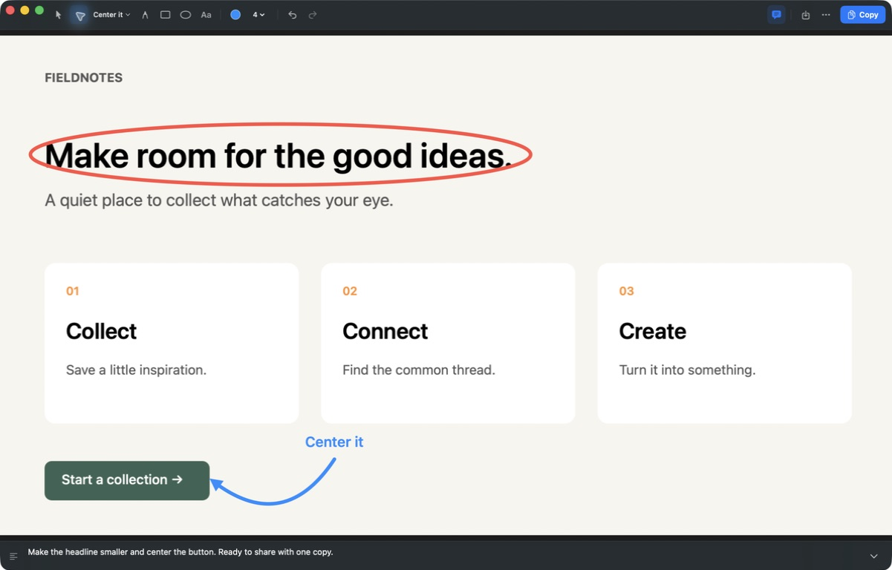

# SnapNote

Capture a region of your screen, mark it up, and copy it with a note. A small native macOS utility with no Dock icon or menu bar clutter.



## Download

Download the universal Mac app from [Releases](https://github.com/LorenzGit/snapnote/releases/latest). Requires **macOS 14 or later**, on Apple Silicon or Intel.

1. Unzip the download and move `SnapNote.app` to Applications.
2. Open SnapNote. This initial release is **not notarized**. If macOS blocks it, open **System Settings → Privacy & Security → Open Anyway** after attempting to launch it. See [Apple's instructions](https://support.apple.com/en-us/102445). Managed Macs may not allow this exception.
3. Press **⌘⇧2**, grant Screen Recording permission when prompted, and select a region. macOS may request an app restart after permission changes.

No account, network access, uploads, or analytics. Images stay on your Mac.

## Annotate

- Arrows with draggable endpoints, a curve handle, preset phrases, and custom labels.
- Freehand drawing, rectangles, ellipses, and colored multiline text.
- Full-image dotted guides with optional percentage labels. Vertical guides measure left to right; horizontal guides measure top to bottom. Labels stay inside the image.
- Shift-drag for circles and squares. Select marks to move them or change their color and size.
- A footer note that grows from one to five lines, then scrolls. Export adds it below the original image without side padding.
- Undo/redo, PNG saving, and clipboard copying at the image's original resolution.
- Hover controls for tooltips and shortcuts.

| Shortcut | Action |
| --- | --- |
| ⌘⇧2 | Capture a region from any app |
| V / A / P / R / E / T | Move / arrow / draw / box / ellipse / text |
| G | Place or drag a dotted guide |
| Shift+G | Switch guide direction, preserving its percentage |
| ⌘⇧P | Show/hide the selected guide percentage, or set it for new guides |
| Shift+Enter | Add a line while typing an annotation |
| Enter or click outside | Finish annotation text and return to Move |
| Escape | Cancel text or deselect a mark |
| Delete | Delete the selected mark |
| [ / ] | Decrease / increase stroke or text size |
| ⌘K | Ink colors |
| ⌘⇧L | Arrow labels, when Arrow or an arrow is selected |
| ⌘⇧N | Show/hide the footer note |
| ⌘Z / ⌘⇧Z | Undo / redo |
| ⌘⇧C | Copy annotated image and footer |
| ⌘S | Save PNG |
| ⌘O / ⌘V | Open / paste an image |
| ⌘, | Settings |
| ⌘Q | Quit |

Closing the window keeps the capture shortcut active and the current edit in memory. Reopen SnapNote to return to it. The More menu includes an optional launch-at-login toggle and Quit. Apple's ⌘⇧4 is unchanged.

## Build from source

Use Xcode with Swift 5.9 or later on macOS 14+. There are no third-party dependencies.

```sh
git clone https://github.com/LorenzGit/snapnote.git
cd snapnote
swift test --disable-sandbox
bash scripts/build.sh --unsigned
```

The explicit unsigned mode creates an ad-hoc-signed universal app and ZIP under `dist/`. Ad-hoc signing provides code integrity, not a verified developer identity. These builds are not notarized; capture permission may need to be granted again after an update.

For stable local signing, configure the ignored files described in `scripts/signing.conf.example`, then run `bash scripts/build.sh`. That path requires your chosen certificate, refuses identity fallback, and updates `build/SnapNote.app` only after verification. Keep that app's identity and location consistent between local builds.

## Limits

- One image at a time. Opening or capturing another replaces the current edit.
- Edits survive closing the window, but not quitting. Saved PNGs flatten annotations and the footer; there are no editable project files yet.
- The capture shortcut is fixed. No history, crop, blur, or automatic updates.
- The initial public build requires a Gatekeeper exception. Future notarized releases require a Developer ID certificate and Apple's notarization service.

## Contributing and license

See [CONTRIBUTING.md](CONTRIBUTING.md). Licensed under [MIT](LICENSE).
